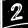

# Sudoku AI

## Auteur

- [Alexandre Jeunot-Caire](https://github.com/jeunotca)


## Visuel


## Description

Programme <b>personnel</b> développé en `Python` de scanner une grille de Sudoku et de la résoudre, avant d'afficher la réponse aux cases manquantes sur la grille.


### Implémentation

Le programme a été développé en `Python` en utilisant principalement les bibliothèques `opencv` (cv2) et `numpy` pour le traitement d'image. La reconnaissance des chiffres est effectuée à l'aide de `Keras / Tensorflow` sur un modèle entraîné sur un dataset custom de **44 321** images issues d'un premier livre de Sudoku.

Les images présentes dans `test` sont issues d'un second livre de Sudoku qui n'a pas participé à l'élaboration du dataset.

## Installation

### Récupération des sources

* Depuis l'invité de commandes (HTTP):
```bash
$ git clone https://github.com/jeunotca/sudoku-solver-ai.git
$ cd sudoku-solver-ai
```

**OU**

* Depuis l'invité de commandes (SSH):
```bash
$ git clone git@github.com:jeunotca/sudoku-solver-ai.git
$ cd sudoku-solver-ai
```

**OU**

* En téléchargeant les sources puis en extrayant l'archive

### Installation

```bash
$ pip install -r requirements.txt
```

**OU**

* En téléchargeant les sources puis en extrayant l'archive

## Utilisation

### Exécution du projet

```bash
$ python3 main.py
```

Dans cette situation, l'algorithme traitera l'image définie dans `default.py`. Sinon, il est également possible de choisir une image en utilisant

```bash
$ python3 main.py -i chemin/de/l/image.jpg
```

Dans les deux cas, la solution sera enregistrée au même endroit que l'image d'origine au format `nom-image-d-origine-result.jpg`.

### Algorithme

<center></center>

L'image subit d'abord un premier traitement, elle est convertie en `niveaux de gris`.

<center></center>

Elle fait ensuite l'objet d'un `flou gaussien de kernel 11` pour éliminer les impuretés.

<center></center>


Un `seuillage adaptatif` est ensuite appliqué.

<center></center>


Puis les couleurs de l'image sont `inversées`.

<center></center>

Les contours de l'image sont ensuite trouvées à l'aide d'un `filtre de Canny`. 

<center></center>

On cherche alors le plus gros contour carré présent, supposé être la grille.

Cette grille subit ensuite une déformation de perspective pour améliorer l'image et donc l'efficacité de l'IA.

<center></center>

Cette nouvelle matrice est découpée en 81 matrices de même taillées, donnant 81 cellules ressemblant à ceci :

<center></center>

Si des pixels blancs sont détectés au centre de l'image, celle-ci est envoyée à un `réseau de neurones`.

Une fois toutes les cases identifiées, on utilise résout la grille. Une première idée était d'utiliser du backtracking, mais le temps passé à résoudre une grille n'était pas négligeable. J'ai donc cherché une [réduction de Karp](https://fr.wikipedia.org/wiki/R%C3%A9duction_polynomiale) vers d'autres problèmes. En particulier, le problème de `couverture exacte` se prête bien ) l'exercice. J'ai donc utilisé le très rapide[algorithme X de Knuth](https://fr.wikipedia.org/wiki/Algorithme_X_de_Knuth). J'ai pour cela utilisé une implémentation déjà existante de la résolution d'une grille de Sudoku.

Après cela, il suffit d'afficher sur une image de la taille de perspective les chiffres manquants : 

<center></center>

On applique ensuite le changement inverse de perspective :

<center></center>

Avant de simplement additionner les deux images :

<center></center>

Les coefficients sont simplement additionnés afin de donner un effet "impacté par l'éclairage".

## AI

* L'IA utilisée est la suivante :
  * Fully connected de 784
  * Conv2D 32 filtres, kernel de 3, stride de 1, fonction ReLU
  * Batch normalization
  * Conv2D 32 filtres, kernel de 3, stride de 1, fonction ReLU
  * Batch normalization
  * Conv2D 32 filtres, kernel de 5, stride de 1, fonction ReLU
  * Batch normalization
  * Dropout de 0.4
  * Conv2D 64 filtres, kernel de 3, stride de 1, fonction ReLU
  * Batch normalization
  * Conv2D 64 filtres, kernel de 3, stride de 1, fonction ReLU
  * Batch normalization
  * Conv2D 64 filtres, kernel de 5, stride de 1, fonction ReLU
  * Batch normalization
  * Dropout de 0.4
  * Fully connected de 128, fonction ReLU
  * Dropout de 0.3
  * Fully connected de 128, fonction ReLU
  * Dropout de 0.4
  * Fully connected de 10, fonction softmax

Optimizeur Adam de learning rate = 1e-4 et loss function `Sparse categorical crossentropy`

Ce modèle a été réalisé en collaboration avec **Michael Gellenoncourt**.

L'IA a un taux de réussite de `99.78%` sur nos tests.

### Dossier AI

Le dossier AI contient le modèle que nous avons utilisé, ainsi que des fonctions permettant si vous le souhaitez de créer vos propres modèles à l'aide des images situées dans le dossier `dataset/raw`.
 